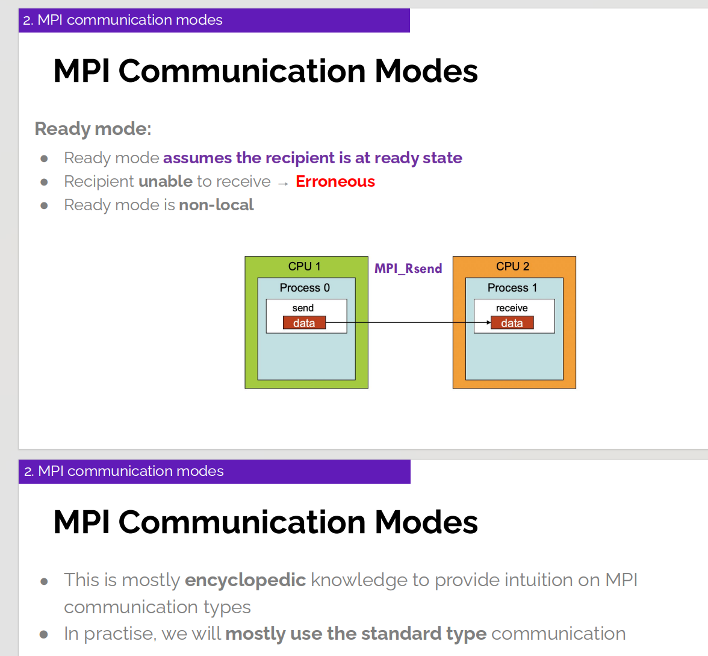
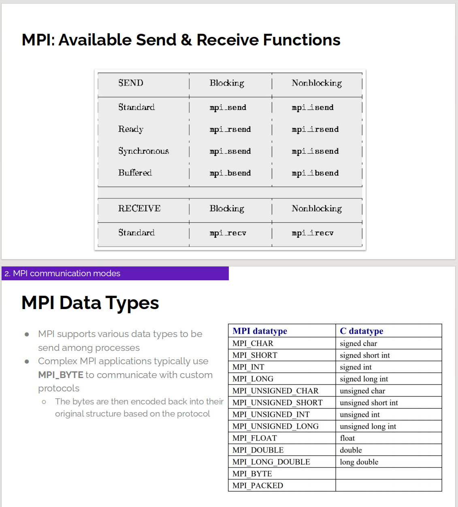

# MPI Lab2


## Ping-pong

很好！这个程序就是一个完整的 **Ping-Pong** 例子，我来帮你分步骤解释一下逻辑。

---

### 程序核心思想

* 使用 **两个进程**（rank 0 和 rank 1）。
* 定义一个计数器 `ping_pong_count`，在两个进程之间来回传递。
* 每次传递时，进程会检查自己是不是该轮的发送方，如果是就把 `ping_pong_count` 加 1 然后发给对方，否则就接收。
* 这个过程持续到 `ping_pong_count == PING_PONG_LIMIT`。

---


```c
MPI_Init(NULL, NULL);

int world_rank;
MPI_Comm_rank(MPI_COMM_WORLD, &world_rank);
int world_size;
MPI_Comm_size(MPI_COMM_WORLD, &world_size);

// We are assuming 2 processes for this task
if (world_size != 2) {
  fprintf(stderr, "World size must be two for %s\n", argv[0]);
  MPI_Abort(MPI_COMM_WORLD, 1);
}
```

* 初始化 MPI 环境。
* 获取进程总数和当前进程的编号。
* 如果进程数不是 2，就直接报错退出。

---

#### Partner 计算

```c
int partner_rank = (world_rank + 1) % 2;
```

* 对于 rank=0，它的伙伴是 1；
* 对于 rank=1，它的伙伴是 0。
  所以每个进程都知道和谁通信。

---

#### 循环 Ping-Pong

```c
while (ping_pong_count < PING_PONG_LIMIT) {
  if (world_rank == ping_pong_count % 2) {
    // 我是当前该发送的进程
    ping_pong_count++;
    MPI_Send(&ping_pong_count, 1, MPI_INT, partner_rank, 0, MPI_COMM_WORLD);
    printf("%d sent and incremented ping_pong_count %d to %d\n", world_rank,
           ping_pong_count, partner_rank);
  } else {
    // 我是该接收的进程
    MPI_Recv(&ping_pong_count, 1, MPI_INT, partner_rank, 0, MPI_COMM_WORLD,
             MPI_STATUS_IGNORE);
    printf("%d received ping_pong_count %d from %d\n", world_rank,
           ping_pong_count, partner_rank);
  }
}
```

* **`ping_pong_count % 2` 决定了谁该发、谁该收**：

  * 如果 `ping_pong_count` 是偶数 → rank 0 发送，rank 1 接收。
  * 如果 `ping_pong_count` 是奇数 → rank 1 发送，rank 0 接收。

* **发送进程**：先把 `ping_pong_count` 加一，再调用 `MPI_Send`。

* **接收进程**：调用 `MPI_Recv` 接收数值。

---

#### 示例运行

假设执行：

```bash
mpirun -np 2 ./ping_pong
```

可能输出：

```
0 sent and incremented ping_pong_count 1 to 1
1 received ping_pong_count 1 from 0
1 sent and incremented ping_pong_count 2 to 0
0 received ping_pong_count 2 from 1
0 sent and incremented ping_pong_count 3 to 1
1 received ping_pong_count 3 from 0
...
```

直到：

```
0 sent and incremented ping_pong_count 9 to 1
1 received ping_pong_count 9 from 0
1 sent and incremented ping_pong_count 10 to 0
0 received ping_pong_count 10 from 1
```

最后 `ping_pong_count == 10`，循环结束。

---

这个程序体现了 **MPI 点对点通信（MPI\_Send / MPI\_Recv）** 的基本模式：

* 两个进程来回发送数据。
* 通过计数和取模来决定谁是发送方、谁是接收方。
* 直到达到指定次数，程序结束。

---

## Communication mode




## Send Functions Table && Data Types



